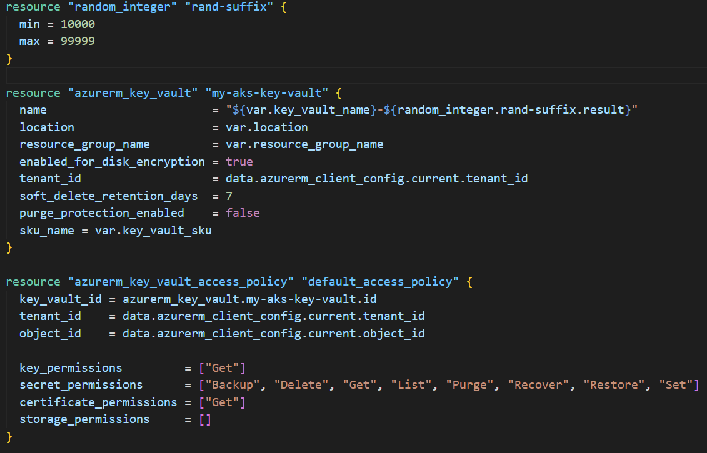
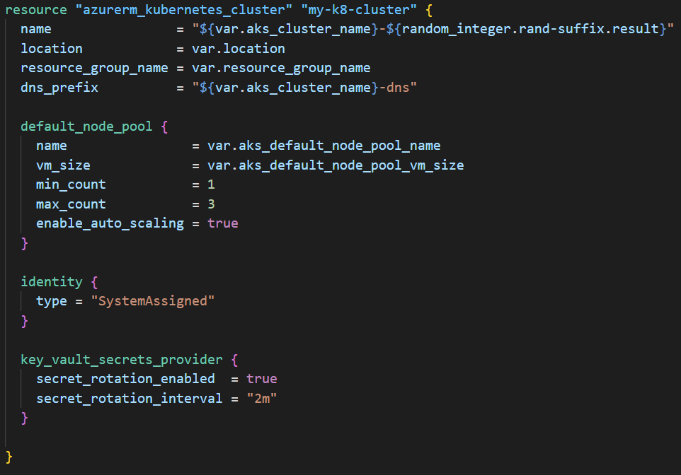
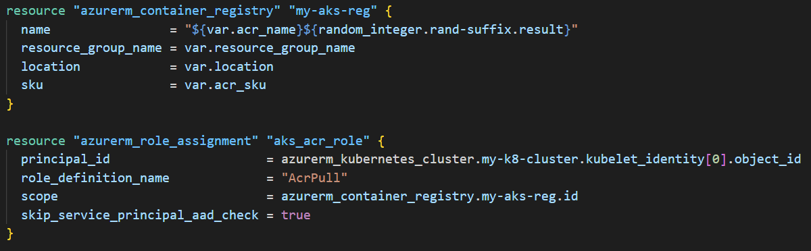
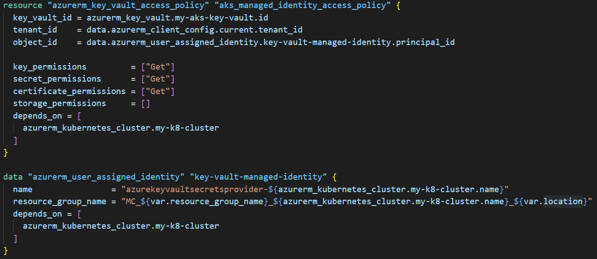

# AKS Key Vault Integration Terraform Walkthrough

This readme will explain the terraform configuration for deploying an AKS Key Vault integration.

The first configuration block declares a random integer resource, this is to help generate resources names that are globally unique in azure, a requirement for provisioning most resources.

Beneath that is the definition for the Azure Key vault itself as well as an inital access policy for you the subscription owner to deploy secrets using the cli or portal. This access policy is decalred separately instead of inline as you will need to declare another access policy later for the Managed Identity generated by the AKS deployment. azurerm_key_vault_access_policy blocks cannot be used with inline access_policy blocks at the same time.

Next is the AKS definition, note the 'key_vault_secrets_provider' block. This ensures the csi drivers are installed on the cluster. It's important to set 'secret_rotation_enabled' to true, this means the AKS cluster will poll the key vault for new or updated secrets. The 'secret_rotation_interval' is the frequency of this polling, it defaults to '2m' (two minutes).

The next block defines the Azure Container Registry and a role assignment to allow the AKS cluster to pull images.

The last but one block creates the access policy that allows the AKS Cluster to access the Key Vault. Note this has a 'depends
\_upon' block. This resource depends upon the AKS cluster being provisioned first or rather the resource group that is generated alongside the AKS Cluster.

The last block is a data block for querying the ClientID from the Managed Identity that is generated when provisioning the AKS Cluster. This is then queried and inserted in the key vault access policy.

