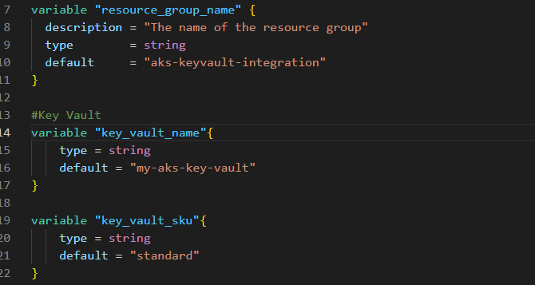
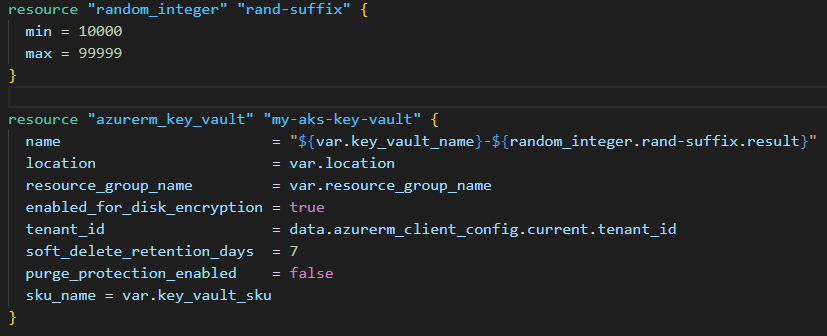
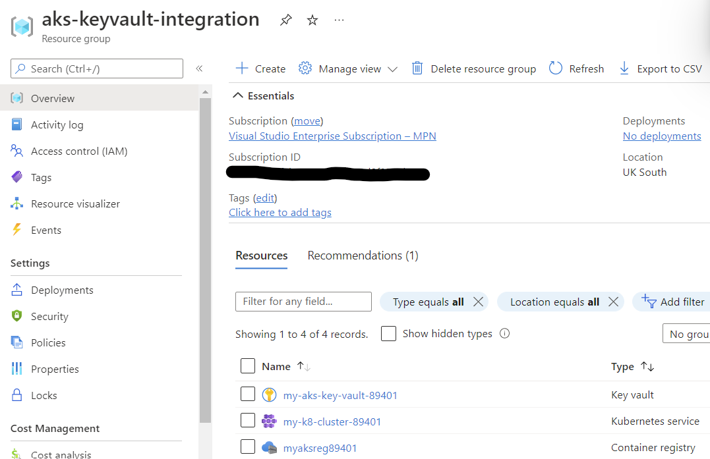
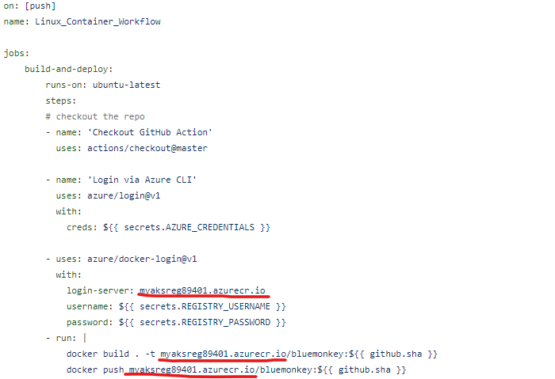
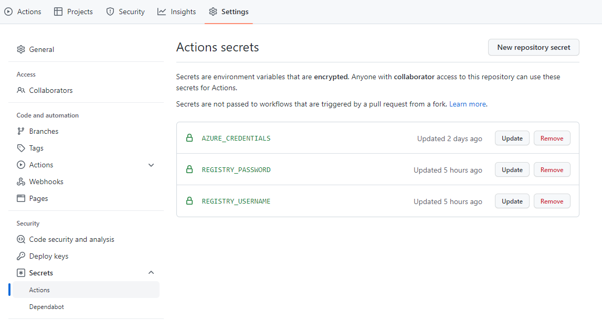
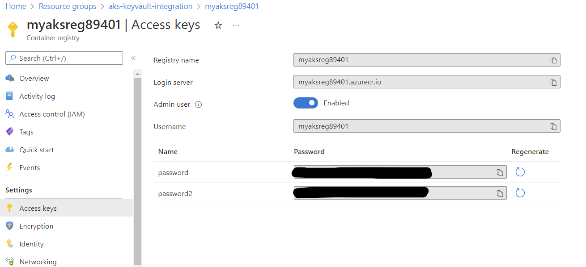
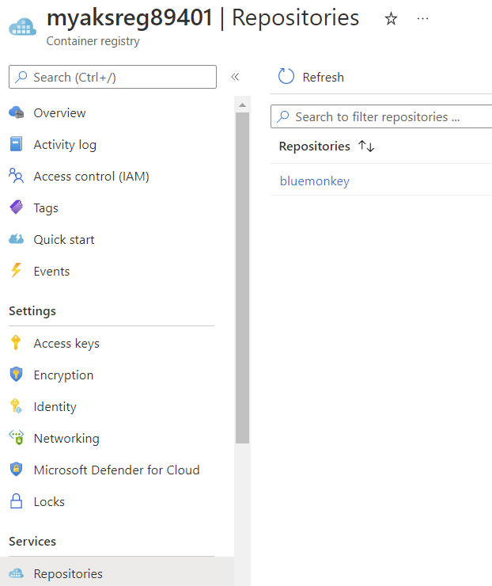
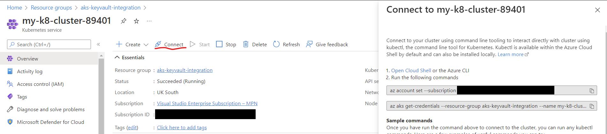
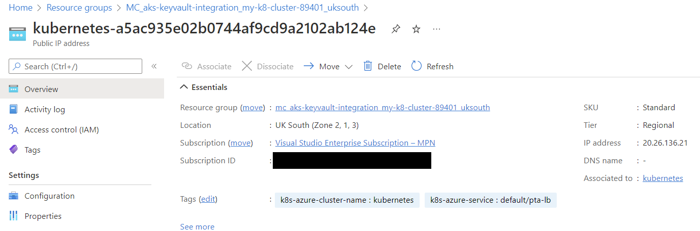
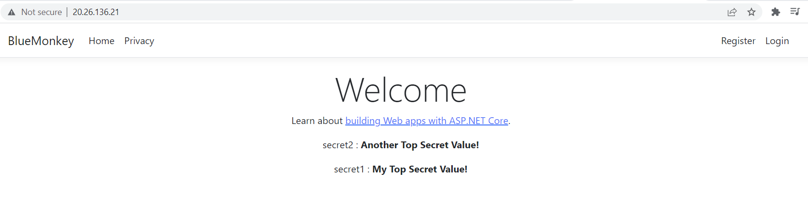

# AKS Key Vault Integration

---

### About

This readme will walk through the process of provisioning an AKS cluster, Azure Key Vault and Azure Container Registry via Terraform. Then deploying a sample .Net Core application via Github actions that will display secrets that are retrieved from Key Vault.

For a detailed walkthrough of the Terraform configuration please refer to [this Readme](./Infrastructure/README.md).

### Prerequisites

The following tools will be used

- Terraform https://www.terraform.io/downloads
- Azure CLI https://docs.microsoft.com/en-us/cli/azure/install-azure-cli
- Kubectl https://kubernetes.io/docs/tasks/tools/
- An Azure account https://azure.microsoft.com/account/free
- A Github account https://github.com/join

### Pre-Deployment Scripts

After installing the Azure CLI, open a terminal and login:

```
az login
```

Create a resource group where the resources will be deployed:

```
$LOCATION = '<your-location>'
$RESOURCE_GROUP = '<your-resource-group-name>'

az group create -n $RESOURCE_GROUP -l $LOCATION
```

### Deploy Infrastructure

After you have installed Terraform, Azure CLI and created your resource group in the azure portal, clone the repo, open a terminal and navigate to the Infrastructure folder.

Run `terraform init` to install the appropriate providers.

Open the [variables.tf](./Infrastructure/variables.tf) file and ensure the resource group variable has the same name as the resource group you have created. Rename any other resources as well.



Most resource names need to be globally unique, in this example most names are suffixed using the `random_integer` from the Terraform random provider.



When you are happy with your variable names run `terraform plan` to preview the resources that are going to be created.

To confirm the deployment run `terraform apply` and type 'yes' when prompted. Deployment should take a few minutes.

You should now have 3 resources created in your resource group. A Kubernetes cluster, a Key Vault and a Container Registry.



### Deploy The Demo Application

You can containerize and deploy your own application or alternatively fork the demo application from [this repo](https://github.com/jDavies-tpx/BlueMonkey).

The demo application is a simple ASP.Net Web application called BlueMonkey that will display the secrets retreived from Key Vault on the home page.

Once you have the souce code update [dockerpush.yml](https://github.com/jDavies-tpx/BlueMonkey/blob/master/.github/workflows/dockerpush.yml) file with your Azure Container Registry name. Don't check this change in yet though. We'll do that later.



Next create a Service Principal using the following command:

```
$RESOURCE_GROUP = '<your-resource-group-name>'
$SUBSCRIPTION_ID = '<your-subscription-id>'
$SERVICE_PRINCIPAL_NAME = '<your-service-principal-name>'

az ad sp create-for-rbac --name $SERVICE_PRINCIPAL_NAME --role="Contributor" --scopes="/subscriptions/$($SUBSCRIPTION_ID)/resourceGroups/$($RESOURCE_GROUP)"
```

Copy the json response which should look something like this:

```
{
    "clientId": "<GUID>",
    "clientSecret": "<GUID>",
    "subscriptionId": "<GUID>",
    "tenantId": "<GUID>",
    (...)
}
```

In github go to your forked version of BlueMonkey then go to Settings > Secrets > Actions.
Add a new Secret named AZURE_CREDENTIALS and paste in the service principal response json as the value.



Next we need to add the Azure Container Registry credentials. Navigate to the Container Registry in the Azure portal and click on Access Keys. Next toggle the Admin user switch to 'enabled'. Copy the values for Username and the first password value.



Back in github, create two more secrets, REGISTRY_USERNAME and REGISTRY_PASSWORD and store the username and password values respectively.

Now check in and push the changes made to [dockerpush.yml](https://github.com/jDavies-tpx/BlueMonkey/blob/master/.github/workflows/dockerpush.yml) earlier. The github action should run successfully and you should be able to see your container image in the Azure portal under the 'Repositories' section of the Azure Container Registry blade.



### Deploy Container to AKS Cluster

If you haven't already, install kubectl locally.
To get the aks credentials and set the current context for the aks cluster, navigate to the Azure portal, go to your AKS Cluster and click connect.



To deploy the test application update [manifest/deploy.yaml](./manifests/deploy.yml) with acr login server details.

```
containers:
        - name: bluemonkey
          image: <your-acr-repository-name>.azurecr.io/<image-name>:<tag>
          imagePullPolicy: Always
          ports:
            - containerPort: 80
          volumeMounts:
            - name: secrets-store-inline
              mountPath: "/mnt/secrets-store"
              readOnly: true
```

Then run the following command:

```
kubectl apply -f ..\manifests\deploy.yml
```

To be able to access the application run the LoadBalancer Service deployment manifest:

```
kubectl apply -f ..\manifest\svc-deploy.yaml
```

### Synching Your First Secret

Before you deploy the SecretsProviderClass manifest you need to get the client id from the Managed Identity that was generated when provisioning the AKS Cluster. To do this go to the azure portal, navigate to the resource group that was generated along with the AKS Cluster deployment, this has a prefix of 'MC' along with the resource group name, aks cluster name and location. e.g.'MC_aks-keyvault-integration_my-k8-cluster-89401_uksouth'. In this resource group will be a Managed Identity prefixed with 'azurekeyvaultsecretsprovider-' and the AKS Cluster name. e.g. 'azurekeyvaultsecretsprovider-my-k8-cluster-89401'. Click on this resource and the ClientId will be displayed in the blade.

Open the [secrets-provider-class-deploy.yml](./manifests/secrets-provider-class-deploy.yml) file and paste the ClientID in userAssignedIdentityID section. Also enter your keyvault name and tenantId.

```
apiVersion: secrets-store.csi.x-k8s.io/v1
kind: SecretProviderClass
metadata:
  name: azure-key-vault-secret-provider
  namespace: default
spec:
  provider: azure
  parameters:
    usePodIdentity: "false"
    useVMManagedIdentity: "true"
    userAssignedIdentityID: "<key-vault-managed-identity-client-id>"
    keyvaultName: "<your-key-vault-name>"
    objects: |
      array:
      - |
        objectName: secret1
        objectType: secret
        objectVersion: ""
    tenantId: "<your-azure-tenant-id>"
```

Deploy the SecretProviderClass with:

```
kubectl apply -f ..\manifest\secrets-provider-class-deploy.yaml
```

Next, using the Azure Cli add secret to key vault using the following command:

```
$KEYVAULT_NAME="<your-key-vault-name>"

az keyvault secret set --vault-name $KEYVAULT_NAME --name secret1 --value "My Top Secret Value!"
```

Ensure your secret name 'secret1' matches the object in the objects array located in the SecretProviderClass shown above. When adding more secrets in future this array will also need to be updated and redeployed. For example if you wanted to add a 2nd secret you would create it using the cli:

```
az keyvault secret set --vault-name $KEYVAULT_NAME --name secret2 --value "Another Top Secret Value!"
```

Then you would update the object array in the SecretProviderClass:

```
objects: |
      array:
      - |
        objectName: secret1
        objectType: secret
        objectVersion: ""
      - |
        objectName: secret2
        objectType: secret
        objectVersion: ""
```

And redeploy the SecretProviderClass:

```
kubectl apply -f ..\manifest\secrets-provider-class-deploy.yaml
```

Navigate to the test application to ensure everything has worked. To do this, in the Azure Portal navigate to the generated resource group e.g. 'MC\_{resource-group-name}\_{aks-cluster-name}\_{location}'. Find the public ip address resource that starts with 'kubernetes', click on it and copy the ip address in the blade.



Paste the ip address into a browser to view the application. If you've used the BlueMonkey sample application you should now see a simple ASP.Net web application which displays your secrets on the welcome screen. (Not terribly practical but you get the idea :laughing:)



### Gotchas

Ensure secretProviderClass in [deploy.yml](./manifests/deploy.yml) matches metadata name in [secrets-provider-class-deploy.yml](./manifests/secrets-provider-class-deploy.yml).

### Next Steps
